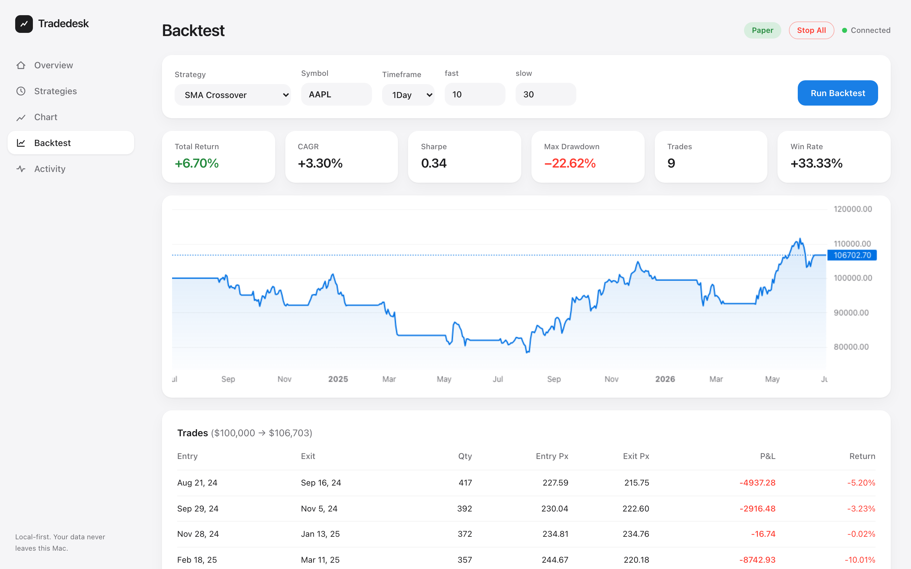
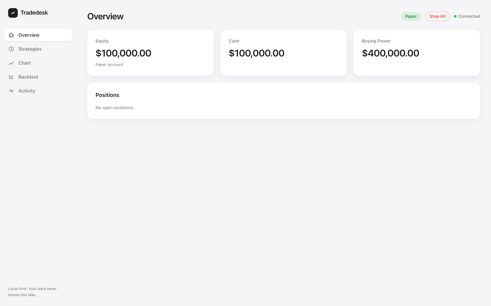
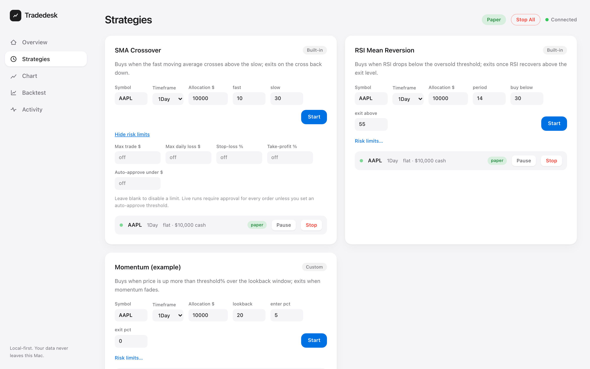
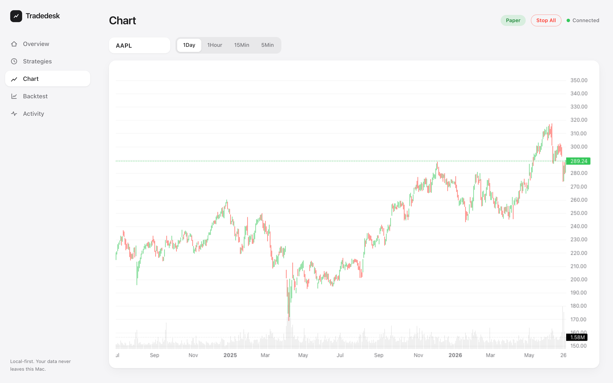

# Tradedesk

**A local-first algorithmic trading platform.** Python strategy engine + broker-agnostic execution layer + an Apple-style React dashboard — all running on your own machine. The only network traffic is to your broker; your keys, trade history, and strategy code never leave localhost.



## Why this exists

Retail algo-trading tools force a choice: hosted platforms that hold your API keys and strategy IP, or heavyweight open-source frameworks with no interface and a steep setup curve. Tradedesk takes a third path — **a private, single-user trading desk** with the ergonomics of a modern product: backtest an idea, promote it to paper trading, watch it execute live on a clean dashboard, and keep every byte of data in a local SQLite file.

## Highlights

| | |
|---|---|
| **Write once, run everywhere** | A strategy is a small Python class. The *same code* runs in backtests and live paper runs — no porting step between research and execution. |
| **Honest backtesting** | Signal on bar close, fill at *next* bar's open. No lookahead bias. Stats: total return, CAGR, Sharpe, max drawdown, win rate, full trade log. |
| **Concurrent strategies, one account** | Each run gets a cash allocation and tracks its own position slice, so multiple strategies trade a single brokerage account without interfering. |
| **Risk engineering as a first-class feature** | Per-run max trade size, max daily loss (auto-flatten + halt), stop-loss/take-profit, a manual-approval queue for orders above a notional threshold, and a global kill switch. |
| **Hot-pluggable strategies** | Drop a `.py` file into `strategies/` — it appears in the dashboard on refresh. Broken files are quarantined and surfaced with their error, never crashing the app. |
| **Full audit trail** | Every order, alert, rail trip, and lifecycle event lands in an append-only activity log. You can always answer "what did the bot do, and why?" |

## Screenshots

| Live dashboard | Strategy management |
|---|---|
|  |  |



## Architecture

```
┌─────────────────────────────┐        ┌──────────────────────────────────────────┐
│   React dashboard (Vite)    │        │            FastAPI backend               │
│   localhost:5173            │  REST  │            localhost:8000                │
│                             │──────▶ │                                          │
│  Overview · Strategies ·    │   WS   │  ┌────────────┐  ┌───────────────────┐  │
│  Chart · Backtest · Activity│◀────── │  │ Backtester │  │  StrategyRunner   │  │
└─────────────────────────────┘        │  │ (bar replay)│  │ (async task/run,  │  │
                                       │  └─────┬──────┘  │  risk rails)      │  │
                                       │        │         └─────────┬─────────┘  │
                                       │        ▼                   ▼            │
                                       │  ┌──────────────────────────────────┐   │
                                       │  │        Broker interface           │   │
                                       │  └───────────────┬──────────────────┘   │
                                       │                  │            SQLite    │
                                       └──────────────────┼──────────────────────┘
                                                          ▼
                                                   Alpaca API (paper/live)
```

Key decisions and their rationale are documented in **[ARCHITECTURE.md](ARCHITECTURE.md)** — including the fill-semantics contract, the per-run allocation model, the approval-queue design, and the concurrency model.

## Safety model

Defense in depth, because software that can trade money should assume it will misbehave:

1. **Paper by default, live triple-locked.** Live mode requires a *separate* live key pair in `.env`, plus typing `TRADE LIVE` into a confirmation dialog. No live keys → the mode switch is rejected server-side, full stop.
2. **Graduated autonomy.** Every run has an *auto-approve threshold*: orders at or below it execute autonomously; anything larger queues for one-click human approval. Live runs default to approve-everything.
3. **Hard limits enforced in the execution path**, not the strategy: notional caps per order, daily-loss auto-halt with position flatten, bar-close stop-loss/take-profit.
4. **Kill switch.** One button stops every strategy and (optionally) flattens all positions at market.
5. **Fail-safe process model.** Strategy exceptions are logged and retried next bar, never fatal. Runs orphaned by a crash are detected and marked stopped on restart. Schema migrations are idempotent.

## Quick start

Requires Python 3.11+ ([uv](https://docs.astral.sh/uv/)) and Node 20+.

```sh
git clone https://github.com/akshatkumbhat/tradedesk && cd tradedesk

# 1. Broker keys — free paper account at https://app.alpaca.markets
cp .env.example .env                      # paste your paper keys in

# 2. Backend
uv run uvicorn backend.main:app --port 8000

# 3. Dashboard (second terminal)
cd frontend && npm install && npm run dev # → http://localhost:5173
```

## Writing a strategy

```python
from backend.engine.strategy import Context, Strategy

class Momentum(Strategy):
    id = "my_momentum"
    name = "Momentum"
    params = {"lookback": 20, "enter_pct": 5.0}   # editable in the dashboard

    def __init__(self, **overrides):
        super().__init__(**overrides)
        self.warmup = int(self.p["lookback"]) + 1

    def on_bar(self, ctx: Context) -> None:       # called once per closed bar
        closes = ctx.history(int(self.p["lookback"]) + 1)["close"]
        change = (closes.iloc[-1] / closes.iloc[0] - 1) * 100
        if ctx.position == 0 and change > self.p["enter_pct"]:
            ctx.buy()                              # fills next bar open / at market
        elif ctx.position > 0 and change < 0:
            ctx.close()
```

Save it in `strategies/`, refresh the dashboard, backtest it, then run it on paper — no other steps.

## Testing

```sh
uv run pytest backend/tests   # 31 tests
```

The suite favors **hand-computed fixtures over snapshots**: exact fill prices and P&L on known bar sequences, drawdown math verified against manual calculation, every risk rail exercised through a fake broker (order capping, approval queueing, daily-loss halt-and-flatten, SL/TP triggers, no-short invariants), plus strategy discovery/quarantine and crash-recovery paths. UI flows are verified with Playwright against the running app.

## Tech stack

**Backend** — Python 3.11, FastAPI, pandas/NumPy, alpaca-py, SQLite (stdlib), pytest.
**Frontend** — React 19 + TypeScript, Vite, Tailwind v4, TradingView lightweight-charts, zustand.

## Current scope & roadmap

Deliberately shipped small and verified end-to-end; the seams for growth are already in place:

- **More brokers/assets** — the `Broker` interface is the only Alpaca-aware surface; Binance (crypto) or IBKR are one adapter file each.
- **Faster backtests** — indicators currently recompute per bar (O(n²)); incremental computation planned before minute-scale multi-year backtests.
- **Broker-side brackets** — SL/TP is app-side per closed bar today; native bracket orders would survive machine sleep.
- **Windows** — nothing platform-specific in the stack; needs a validation pass.

## License & disclaimer

[MIT](LICENSE). Nothing here is financial advice, and algorithmic trading involves substantial risk — the paper-first, approval-gated design exists for a reason.
